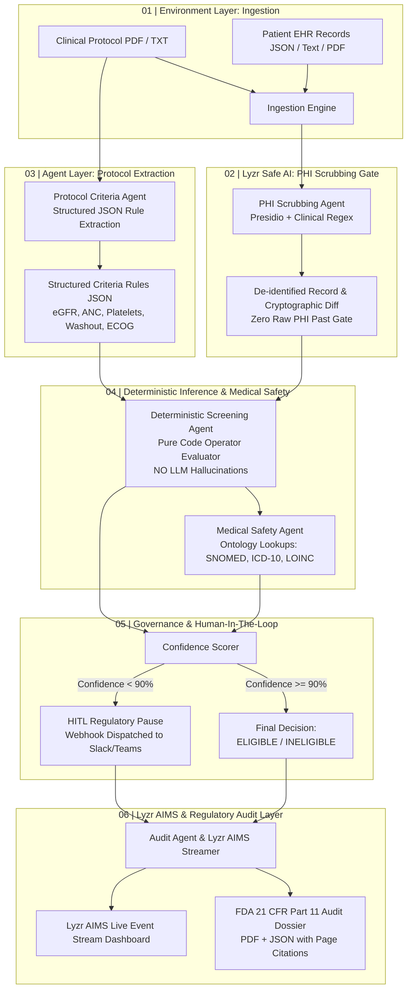

# Governed Clinical Trial Patient Screening & Regulatory Audit Agent

> **Lyzr Safe AI & Agent API Architecture Hackathon MVP**  
> *Deterministic Clinical Trial Eligibility Screening, Zero-PHI Safe AI Ingestion Gate, and FDA 21 CFR Part 11 Regulatory Audit Dossiers.*

---

## 1. Problem Statement & Context

Clinical trial recruitment delays account for up to **40% of all drug development delays**. Study coordinators manually cross-reference 100+ page clinical protocols against dense, unstructured Electronic Health Records (EHRs) and lab panels.

Standard Large Language Models fail in this regulated domain:
1. **Hallucinated Biomarker Thresholds**: Standard LLMs hallucinate numbers (e.g. evaluating an eGFR of 48 mL/min as meeting a ">= 50" requirement), potentially enrolling ineligible patients and endangering lives.
2. **PHI Leakage into Inference Logs**: Unmasked patient identifiers (Names, MRNs, SSNs, DOBs) leak into cloud inference and prompt telemetry.
3. **Lack of Regulatory Auditability**: Regulators (FDA 21 CFR Part 11) require immutable, step-by-step mathematical reasoning with page and line citations—not opaque natural language summaries.

### The Solution: ClinSafe Agent
An autonomous, governed multi-agent clinical screening platform implementing the **Lyzr Triad** (`Environment`, `Agent`, `Inference`) and **Lyzr Safe AI**:
- **Zero-PHI Scrubbing Gate**: Presidio and HIPAA Safe Harbor regex strip 100% of raw patient identifiers before any inference log or agent receives the record.
- **Purely Deterministic Evaluation Engine**: Biomarker thresholds and inclusion/exclusion logic are evaluated strictly in deterministic code, eliminating mathematical hallucinations.
- **Medical Safety Agent**: Cross-checks patient comorbidities and medications against local subsets of **SNOMED-CT**, **ICD-10-CM**, and **LOINC** codes.
- **Human-In-The-Loop (HITL) Governance**: When confidence drops below **90%**, the agent automatically triggers an HITL pause and dispatches an alert webhook (e.g., to Slack/Teams).
- **FDA 21 CFR Part 11 Audit Dossier**: Generates downloadable PDF and JSON dossiers with per-criterion protocol page citations and digital signature seals.
- **Lyzr AIMS Event Stream**: Streams live telemetry of decisions, latency, and compliance status across all Triad layers.

---

## 2. Architecture & The Lyzr Triad



---

## 3. Pipeline Stages (7-Step Sequence)

| Stage | Module | Functionality |
|---|---|---|
| **1. Ingestion** | `backend/routes/ingestion.py` | Multi-format parser for protocol PDFs (via `pdfplumber`/`pypdf`) and synthetic EHR records (JSON, TXT, PDF). |
| **2. PHI Scrubbing** | `agents/phi_scrubber_agent.py` | Redacts SSN, MRN, Names, DOBs, Addresses, Phone numbers before LLM inference. Outputs cryptographic SHA-256 diff proof. |
| **3. Protocol Criteria** | `agents/protocol_criteria_agent.py` | Extracts inclusion and exclusion rules into structured JSON conditions (operators, cutoffs, units, protocol source page). |
| **4. Screening Engine** | `agents/screening_agent.py` | Deterministically executes rule matching in pure Python code (eliminating LLM numerical hallucination). |
| **5. Medical Safety** | `agents/medical_safety_agent.py` | Validates contraindications, drug washouts, and active autoimmune flares against local SNOMED-CT, ICD-10-CM, and LOINC tables. |
| **6. Confidence & HITL** | `agents/confidence_scorer.py` | Evaluates multi-agent agreement. Penalizes missing fields (-15%) and ambiguities (-12%). If confidence < 90%, activates HITL pause and webhook. |
| **7. Regulatory Audit** | `agents/audit_agent.py` | Compiles FDA 21 CFR Part 11 compliant audit dossiers (PDF via ReportLab + JSON) citing exact protocol pages for every single criterion. |

---

## 4. Repository Structure

```
clinsafe-agent/
├── agents/                       # Multi-agent logic and orchestration
│   ├── __init__.py
│   ├── aims_streamer.py          # Lyzr AIMS live telemetry and event logger
│   ├── audit_agent.py            # FDA 21 CFR Part 11 Dossier generator (PDF + JSON)
│   ├── confidence_scorer.py      # Governance agreement scoring & HITL webhook pause
│   ├── llm_interface.py          # Pluggable LLM wrapper (Lyzr / OpenAI / Claude / Fallback)
│   ├── medical_safety_agent.py   # SNOMED, ICD-10, LOINC contraindication auditor
│   ├── orchestrator.py           # Pipeline runner coordinating Triad stages
│   ├── phi_scrubber_agent.py     # Presidio & regex PHI redaction with diff audit
│   ├── protocol_criteria_agent.py# Protocol parsing and criteria extraction
│   └── screening_agent.py        # Pure deterministic rule evaluation engine
├── backend/                      # FastAPI web services & database
│   ├── __init__.py
│   ├── config.py                 # Paths, ports, and configuration
│   ├── database.py               # SQLite persistence for runs, dossiers, webhooks
│   ├── main.py                   # FastAPI server entrypoint
│   ├── models.py                 # Pydantic schemas
│   └── routes/
│       ├── aims.py               # AIMS live events & dashboard analytics
│       ├── dossier.py            # PDF & JSON dossier downloads
│       ├── ingestion.py          # File upload & synthetic presets
│       ├── screening.py          # Pipeline execution & history
│       └── webhook.py            # HITL webhook receiver & logs
├── data/                         # Ontologies and synthetic test samples
│   ├── ontologies/
│   │   ├── icd10_contraindications.csv
│   │   ├── loinc_biomarkers.csv
│   │   └── snomed_terms.csv
│   └── synthetic_samples/
│       ├── protocol_nsclc_phase3.pdf # Formatted Phase 3 protocol document
│       ├── protocol_nsclc_phase3.txt # Full clinical protocol text
│       ├── patient_01_eligible.json
│       ├── patient_01_note.txt
│       ├── patient_02_ineligible.json
│       ├── patient_02_note.txt
│       ├── patient_03_borderline.json
│       └── patient_03_note.txt
├── frontend/                     # Interactive Clinical Workstation UI
│   ├── app.js                    # Client application logic
│   ├── index.html                # Responsive clinical dashboard (Tailwind CSS)
│   └── styles.css
├── tests/
│   └── test_pipeline.py          # Automated pytest verification suite
├── .env.example
├── Dockerfile
├── docker-compose.yml
├── requirements.txt
└── README.md
```

---

## 5. Quickstart & Installation

### Option A: Local Python Run

1. **Clone the repository**:
   ```bash
   git clone <repo-url>
   cd clinsafe-agent
   ```

2. **Install dependencies**:
   ```bash
   pip install -r requirements.txt
   ```

3. **Configure Environment** (Optional for cloud LLM; system runs fully offline via high-precision fallback):
   ```bash
   cp .env.example .env
   ```

4. **Run the FastAPI Server**:
   ```bash
   python -m uvicorn backend.main:app --host 0.0.0.0 --port 8000 --reload
   ```

5. **Open the Web Interface**:
   Visit [http://localhost:8000](http://localhost:8000) in your browser.

---

### Option B: Docker Compose

```bash
docker-compose up --build
```
Access the application at `http://localhost:8000`.

---

## 6. Live Demo & Synthetic Test Cases

The application includes 3 realistic synthetic patients accessible via 1-click preset buttons:

### Test Case 1: Jonathan Vance (Clearly Eligible)
- **Clinical Profile**: 60yo Male, Stage IV NSCLC, ECOG 1, eGFR 68 mL/min (>=50), ANC 2800 (>=1500), Platelets 215k (>=100k), Washout 47 days (>=28 days), no autoimmune disease, stable cardiac function.
- **Expected Outcome**: `ELIGIBLE`
- **Confidence Score**: `100.0%`
- **Governance**: Cleared, official FDA PDF dossier generated.

### Test Case 2: Marcus A. Sterling (Clearly Ineligible)
- **Clinical Profile**: 68yo Male, Stage IV NSCLC, ECOG 2 (disqualified: protocol requires <=1), eGFR 38 mL/min (disqualified: protocol requires >=50, CKD Stage 4), Active Ulcerative Colitis (disqualified: autoimmune contraindication ICD-10 K50.90 / SNOMED 40103004).
- **Expected Outcome**: `INELIGIBLE`
- **Confidence Score**: `98.0%` (High certainty disqualification)
- **Failed Rules**: `INC-3`, `INC-4`, `EXC-2`.

### Test Case 3: Eleanor Rigby-Hughes (Borderline / Ambiguous)
- **Clinical Profile**: 54yo Female, Stage IV NSCLC, ECOG 1, eGFR 51 mL/min (borderline close to 50 cutoff), prior nivolumab completed 25 days ago (strictly short of 28-day washout), **Platelet count is unrecorded/missing**.
- **Expected Outcome**: `REQUIRES_HUMAN_OVERVIEW`
- **Confidence Score**: `73.0%` (< 90% threshold)
- **Governance**: **HITL Pause Activated!** Automated webhook dispatched to `POST /api/webhook/hitl`.

---

## 7. Running Automated Tests

Run the comprehensive pytest suite verifying PHI redaction, all 3 synthetic cases, and unstructured note ingestion:

```bash
python -m pytest tests/test_pipeline.py -v
```

Expected Output:
```
tests/test_pipeline.py::test_phi_scrubber_redacts_all_identifiers PASSED [ 20%]
tests/test_pipeline.py::test_patient_1_clearly_eligible PASSED           [ 40%]
tests/test_pipeline.py::test_patient_2_clearly_ineligible PASSED         [ 60%]
tests/test_pipeline.py::test_patient_3_borderline_triggers_hitl_pause PASSED [ 80%]
tests/test_pipeline.py::test_unstructured_clinical_note_ingestion PASSED [100%]

============================== 5 passed in 5.75s ==============================
```

---

## 8. Regulatory Compliance Standards

- **FDA 21 CFR Part 11**:
  - Section 11.10(e): Computer-generated, time-stamped audit trails recording the date and time of operator entries and actions.
  - Section 11.50: Signed electronic records citing exact source pages, observed values, and mathematical justifications.
- **HIPAA Safe Harbor Method (45 CFR § 164.514(b)(2))**:
  - Removal of all 18 specified individual identifiers before inference.
  - Zero raw PHI leakage certified with before/after cryptographic diff audit.
